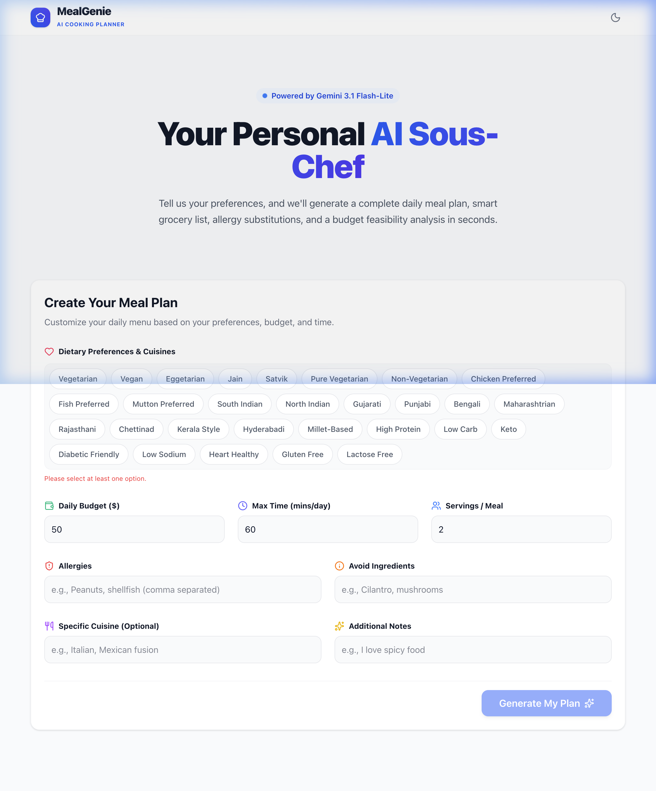

# 🧑‍🍳 MealGenie — AI Daily Cooking Planner

MealGenie is a production-quality, client-only AI-powered daily cooking planner. Built with React 19, Vite, TypeScript, and Tailwind CSS v4, it guides users through a multi-step AI workflow to generate personalized meal plans, smart grocery lists, recipe ingredient substitutions, and budget feasibility reports. 

Powered directly by the **Google Gemini API**, MealGenie uses strict Zod schema validation to ensure structured, reliable JSON responses.

<table>
  <tr>
    <td align="center"><b>App Preview</b></td>
    <td align="center"><b>Walkthrough Flow</b></td>
  </tr>
  <tr>
    <td></td>
    <td></td>
  </tr>
</table>

---

## 🚀 Key Features

*   **Multi-Step AI Workflow**: Sequentially generates meal plans, grocery lists, ingredient substitutions, and budget assessments using state-of-the-art LLMs.
*   **Centralized State Management**: Uses [Zustand](https://github.com/pmndrs/zustand) for clean, reactive, and predictable state transitions.
*   **Strict Type & Schema Safety**: Validates AI responses using [Zod](https://zod.dev) schemas before updating app state.
*   **Aesthetic & Modern UI**: Built with Tailwind CSS v4, Framer Motion for smooth micro-animations, and Lucide React icons.
*   **High Performance**: Minimal dependency footprint and fast HMR with Vite. Linted with Oxlint.

---

## 🛠️ Tech Stack

*   **Frontend**: React 19, TypeScript, Vite
*   **Styling**: Tailwind CSS v4, Framer Motion (for animations), Lucide React (for icons)
*   **State Management**: Zustand
*   **AI Integration**: `@google/genai` (SDK for Gemini API)
*   **Validation**: Zod
*   **Linter**: Oxlint

---

## 📦 Project Structure

```text
src/
├── components/          # React components
│   ├── common/          # Reusable UI elements (Spinner, Buttons, etc.)
│   ├── layout/          # Page layouts and containers
│   ├── DayContextForm.tsx  # Initial user preference questionnaire
│   ├── DashboardWidgets.tsx # Interactive AI progress cards
│   ├── MealPlanDisplay.tsx   # Displays generated daily meal plan
│   ├── GroceryListDisplay.tsx # Itemized grocery check-list
│   ├── SubstitutionsPanel.tsx # Ingredient substitution recommendations
│   └── BudgetFeasibility.tsx  # Budget & cost-efficiency analysis
├── services/            # API services
│   └── agent.ts         # Gemini API calls and Zod validation schemas
├── store/               # Centralized state management
│   └── usePlannerStore.ts # Zustand global store
├── types/               # TypeScript interfaces
├── utils/               # Common helper utilities
├── App.tsx              # Main application orchestrator
└── main.tsx             # Application entry point
```

---

## ⚙️ Clean Setup & Installation

Follow these steps to set up MealGenie locally.

### 1. Prerequisites
Make sure you have Node.js (version 18 or above) installed on your system.

### 2. Clone and Install Dependencies
Navigate to the project root directory and install dependencies:
```bash
npm install
```

### 3. Environment Variables
MealGenie interacts directly with the Gemini API from the client side. You must supply your own API key.

1. Copy the template environment file:
   ```bash
   cp .env.example .env
   ```
2. Open `.env` and replace `YOUR_API_KEY_HERE` with your actual Google AI Studio key:
   ```env
   VITE_GEMINI_API_KEY=AIzaSy...
   ```
   > 🔑 Get your API key from [Google AI Studio](https://aistudio.google.com/app/apikey).

### 4. Run Locally
Start the local Vite development server:
```bash
npm run dev
```
Open [http://localhost:5173](http://localhost:5173) in your browser to view the application.

### 5. Linting
Verify code quality using the Oxlint linter:
```bash
npm run lint
```

### 6. Testing
Run the unit test suite powered by Vitest:
```bash
npm run test
```

---

## 🔁 Continuous Integration (CI)

A GitHub Actions workflow is configured in [.github/workflows/ci.yml](file:///Users/kg/Documents/mealgenie/.github/workflows/ci.yml) to automatically validate every push and pull request to the `main` or `master` branches. The pipeline:
1. Installs all required dependencies.
2. Lints the codebase with Oxlint (`npm run lint`).
3. Runs all unit tests with Vitest (`npm run test`).
4. Verifies TypeScript compilation and build compilation (`npm run build`).

> [!TIP]
> Ensure that the `VITE_GEMINI_API_KEY` is added to your GitHub repository secrets so that the production build check passes successfully on the CI server.

---

## 🚀 Firebase Deployment

MealGenie is configured to be hosted on Firebase.

### 1. Prerequisites
Make sure you have the Firebase CLI installed globally:
```bash
npm install -g firebase-tools
```

### 2. Authentication
Log in to your Firebase account:
```bash
firebase login
```

### 3. Select Project
The project is preconfigured in `.firebaserc` to use the Firebase project `mealgenie-84242`. Make sure you are using it:
```bash
firebase use default
```

### 4. Build Production Bundle
Vite compiles and bundles variables prefixing with `VITE_` during compile time. Ensure your `.env` file containing `VITE_GEMINI_API_KEY` is present locally before running the build command:
```bash
npm run build
```
This command compiles the TypeScript files and outputs static assets into the `dist/` directory.

### 5. Deploy
Deploy the build assets to Firebase Hosting:
```bash
firebase deploy
```

Once deployment is complete, Firebase CLI will provide the Hosting URL (e.g., `https://mealgenie-84242.web.app`).

---

## 🔒 Security Note on Client-Side Keys

This project communicates directly with the Gemini API from the client-side browser using `VITE_GEMINI_API_KEY`. 

> [!WARNING]
> Exposing API keys directly in client-side bundles is not recommended for production environments where abuse is a concern. For a fully productionized setup, we recommend routing AI generation requests through a secure backend proxy or Firebase Cloud Function to keep API keys hidden.
